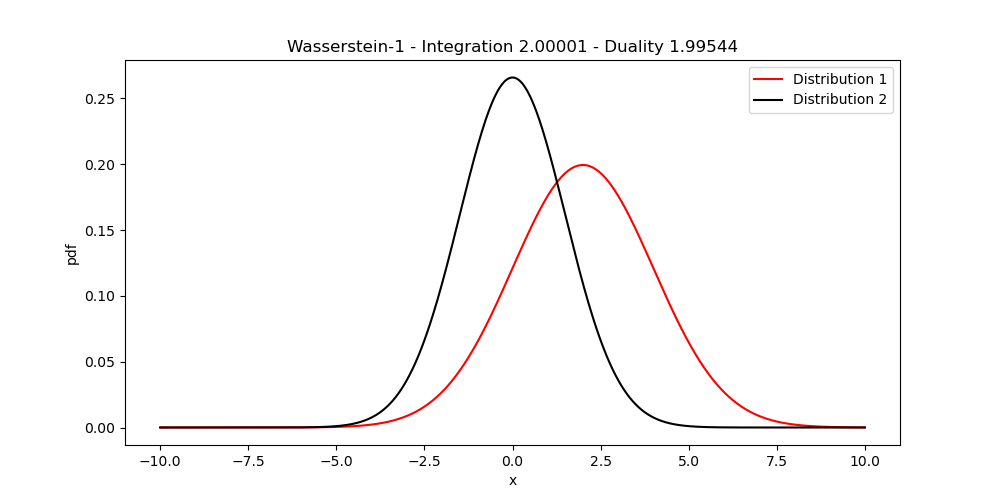

# Wasserstein-1 Estimation

Small Toy-Example of using the Kantorovich-Rubinstein duality of the
[Wasserstein-1](https://en.wikipedia.org/wiki/Wasserstein_metric) metric to estimate the distance between two
1D distributions. According to this duality, the Wasserstein-1 distance between two distributions P and Q is:

$$W_1(P||Q) = \underset{\lVert h \rVert_L \leq 1}{\text{sup}} \underset{x \sim P}{\mathbb{E}}[h(x)] - \underset{x \sim Q}{\mathbb{E}}[h(x)],$$

where the supremum is taken over all 1-Lipschitz functions. We estimate $h$ using a fully-connected neural network.
To enforce the Lipschitz constraint, we use projected gradient descent proposed in ['Regularisation of Neural Networks by Enforcing
Lipschitz Continuity'](https://arxiv.org/pdf/1804.04368.pdf) which divides each weight matrix by its spectral norm
if it surpasses 1. As the Lipschitz constant of the composition of functions is smaller than the product of their
individual Lipschitz constants, this ensures that our entire network is 1-Lipschitz. The same duality is also the main
idea behind [Wasserstein GANs](https://arxiv.org/abs/1701.07875), where the discriminator has the same interpretation
as our function $h$. 

To get an idea about the accuracy of our estimation, we can use the special formula for the $W_1$ distance between
two one-dimensional distributions with CDFs $F$ and $G$:

$$ W_1(P||Q) = \int_\mathbb{R} |F(x) - G(x) |dx.$$

To evaluate this expression, we use simple numerical integration.

